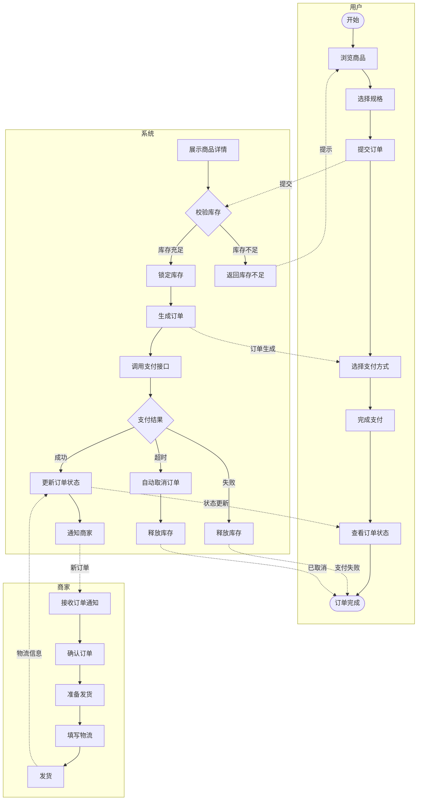
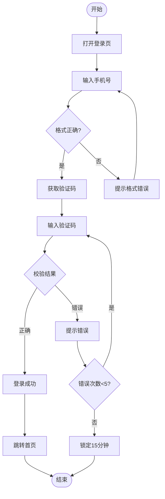
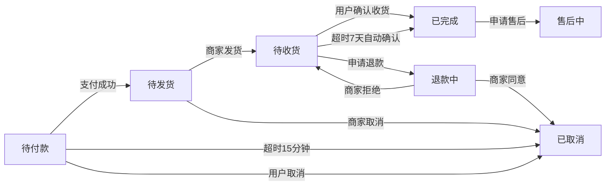
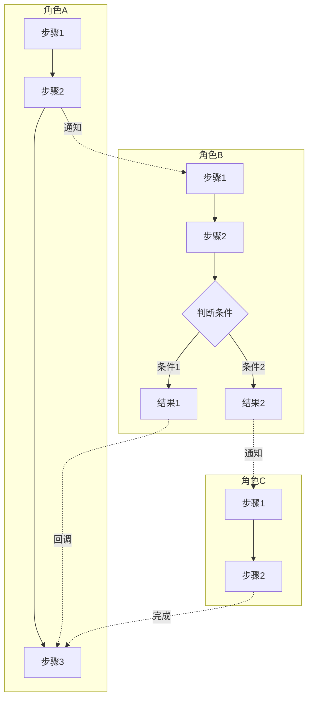
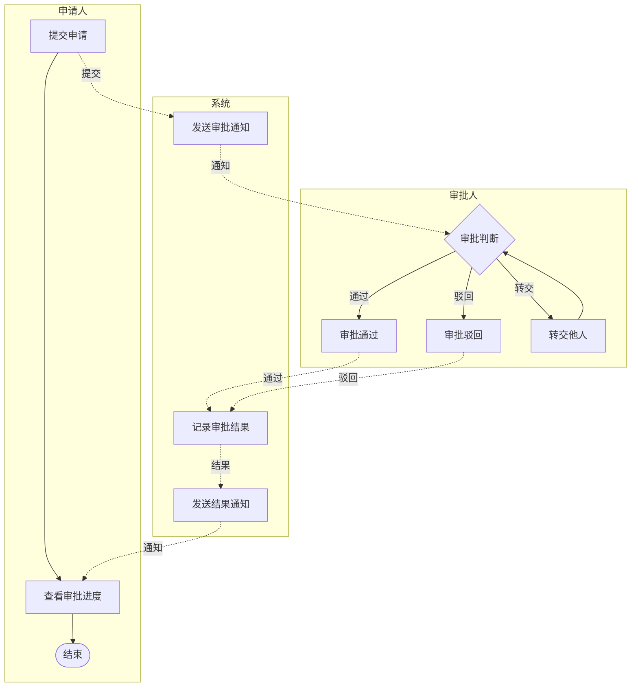
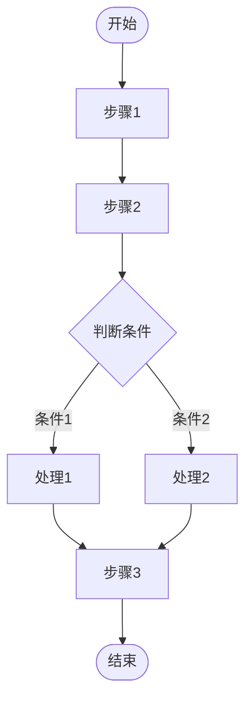
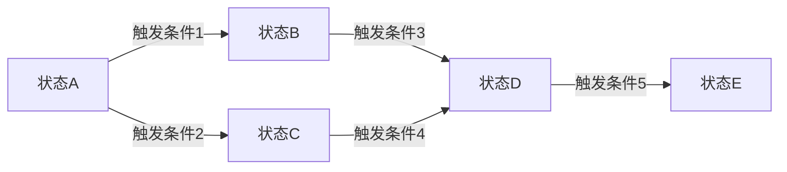
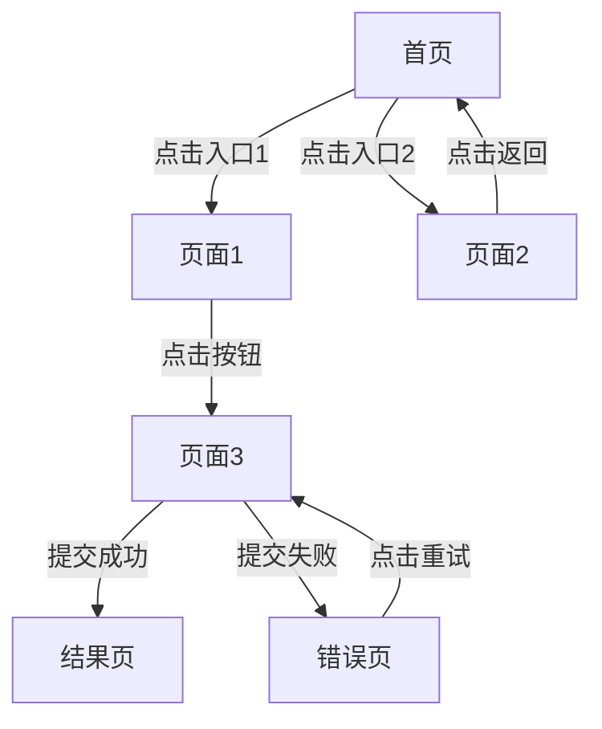
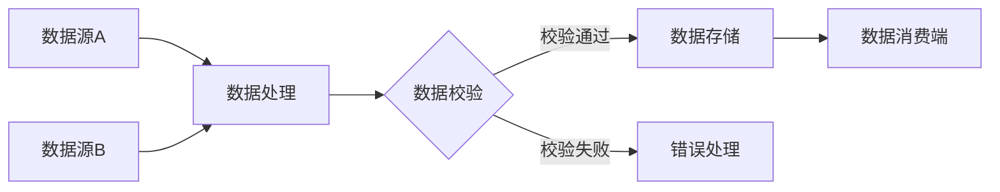

# 流程图模板

> 本文件提供流程图输出的标准格式和各场景模板骨架。
> 遵循 `references/流程图生成规范.md` 中的规则。

---

## 一、结构确认模板

输出完整流程图前，必须先输出以下结构确认内容：

```
【流程名称】：XXX

【流程类型】：多角色泳道图 / 单角色序列图 / 状态流转图

【涉及角色】：
- 角色1：XXX（说明角色在流程中的职责）
- 角色2：XXX
- 角色3：XXX（如有）

【流程路径概览】：
- 正向路径：角色→步骤→步骤→...→完成
- 主要分支：[条件A→处理A]、[条件B→处理B]
- 异常路径：[超时→处理]、[失败→处理]、[权限不足→处理]

【流程起点】：XXX
【流程终点】：XXX

以上结构是否准确？确认后我将展开完整流程图。有调整请告诉我。
```

---

## 二、Mermaid 输出格式

### 格式规则

- 使用 `graph TD`（从上到下）或 `graph LR`（从左到右）
- 节点 ID 用有意义的缩写：`U` 用户、`S` 系统、`M` 商家、`D` 判断、`E` 异常
- 节点文字用方括号 `[]`、判断用花括号 `{}`、起止用双圆括号 `(())`
- 正常流程用实线箭头 `-->`
- 跨角色通知/回调用虚线箭头 `-.->`
- 分支条件标注在箭头上：`-- 条件 -->`
- 文件头部用 `%%` 注释标注流程元信息

### 完整格式示例（多角色泳道图）



### 完整格式示例（单角色序列图）



### 完整格式示例（状态流转图）



---

## 三、场景模板骨架

### 3.1 多角色业务流程（泳道图）



### 3.2 审批流（泳道图）



### 3.3 单角色操作流程（序列图）



### 3.4 状态流转图



### 3.5 页面跳转流



### 3.6 数据流转图



---

## 四、Markdown 说明文件模板

```markdown
# 【流程名称】

## 流程概述
- 流程类型：多角色泳道图 / 单角色序列图 / 状态流转图
- 涉及角色：角色1、角色2、角色3
- 流程起点：XXX
- 流程终点：XXX

## 角色职责
- **角色1**：职责描述
- **角色2**：职责描述
- **角色3**：职责描述

## 分支说明
- 分支条件1 → 处理结果1
- 分支条件2 → 处理结果2
- 分支条件3 → 处理结果3

## 异常处理
- 异常类型1：处理方式
- 异常类型2：处理方式
- 异常类型3：处理方式

## 备注
- AI 补充节点 X 个
- 待确认节点 X 个
```

---

## 五、WPS 导入快速检查单

导入 WPS 前，确认以下事项：

- [ ] 使用 `graph TD` 或 `graph LR`，非其他图表类型
- [ ] 节点定义使用 `[]` `{}` `(())`，无复杂形状
- [ ] 箭头使用 `-->` `-.->` `-- 文字 -->`，无粗箭头
- [ ] 未使用 `classDef` / `class` 语法
- [ ] 未使用 `style` 语法（或仅在 HTML 预览中使用）
- [ ] 无语法错误（可在 Mermaid Live Editor 验证）
- [ ] 文件编码为 UTF-8
