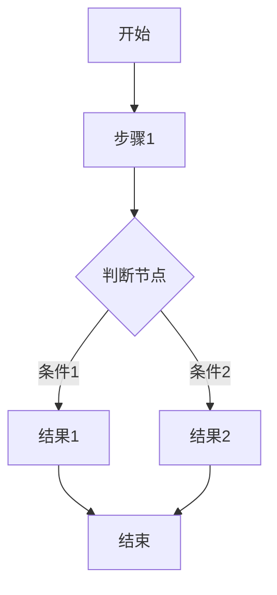
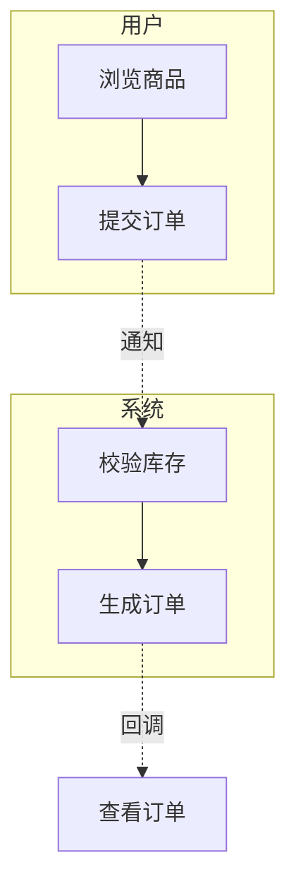
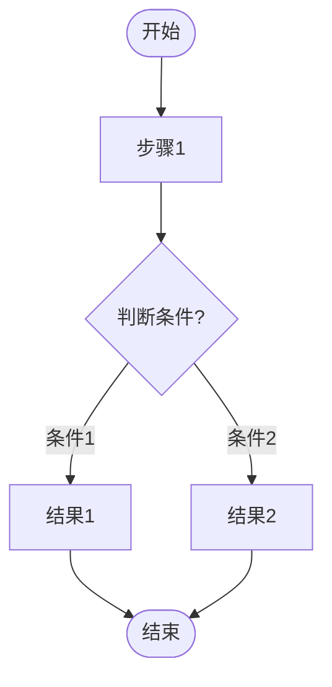

# 流程图生成规范

> 本文件定义流程图生成的全部规则。流程图Agent和所有涉及流程图输出的场景必须遵守本规范。
> 具体输出格式参见 `references/流程图模板.md`。

---

## 一、核心原则

1. **闭环原则**：每条路径必须有明确的终点，不能有去无回。
2. **角色分明原则**：多角色流程必须使用泳道图，一个角色一个泳道，每个步骤归属明确。
3. **覆盖完整原则**：正向路径、异常路径、回退路径必须全部覆盖。
4. **简洁清晰原则**：步骤表述精简，分支条件明确，泳道间交互清晰标注。
5. **可导入原则**：输出的 Mermaid 源码必须兼容 WPS 流程图导入，不使用的语法特性需标注。

---

## 二、流程图类型选择规范

### 多角色流程（2 个及以上角色）

- 必须使用泳道图结构
- 角色包括：不同类型用户、系统、外部服务、定时任务
- 一个角色一个泳道，用 `subgraph` 实现
- 泳道内按时序排列步骤

### 单角色流程

- 使用标准序列结构（`graph TD`）
- 按操作时序展开步骤
- 每个步骤标注操作主体 `【角色名】操作内容`

### 状态流转

- 使用状态节点结构（`graph LR` 或 `graph TD`）
- 核心主题为"XX对象状态流转图"
- 状态为节点，转移条件为箭头标注

---

## 三、Mermaid 语法规范

### 基础语法



### 节点类型

| 节点形状 | Mermaid 语法 | 用途 |
|---------|-------------|------|
| 圆角矩形 | `A[文本]` | 开始/结束节点 |
| 矩形 | `A[文本]` | 操作步骤 |
| 菱形 | `A{文本}` | 判断节点 |
| 圆形 | `A((文本))` | 起止点（可选） |
| 子流程 | `A[[文本]]` | 引用子流程 |

### 泳道图语法（subgraph）



### 箭头样式

| 样式 | 语法 | 用途 |
|------|------|------|
| 实线箭头 | `-->` | 正常流程走向 |
| 虚线箭头 | `-.->` | 跨角色通知/回调 |
| 带文字箭头 | `-- 文字 -->` | 分支条件标注 |
| 粗箭头 | `==>` | 强调路径（慎用） |

### 样式定义（WPS 兼容性说明）

WPS 对 Mermaid 的 `style` 语法支持有限，建议：
- 不依赖 `style` 语法实现核心逻辑
- 如需样式，仅在 HTML 预览文件中使用
- WPS 导入时以默认样式渲染

---

## 四、节点命名规范

### 文字长度

- 每个节点控制在 20 字以内，超过需精简
- 用核心关键词表述，不用完整句子
- 示例："用户点击搜索框后系统展示搜索页面" → "输入搜索关键词"

### 表述格式

| 类型 | 格式 | 示例 |
|---|---|---|
| 操作步骤 | 动词+名词 | "提交订单"、"填写物流信息" |
| 判断节点 | 条件关键词+问号 | "库存充足？"、"支付成功？" |
| 开始/结束 | 状态描述 | "流程开始"、"订单完成" |
| 异常处理 | 异常类型→处理 | "支付超时→自动取消" |
| 角色交互 | 动作+对象 | "通知系统校验库存" |

### 节点 ID 规范

- 使用有意义的缩写，如 `U1`（用户步骤1）、`S1`（系统步骤1）、`A1`（审批节点1）
- 同一角色的步骤使用相同前缀，便于识别
- 判断节点用 `D` 前缀，如 `D1`、`D2`

---

## 五、泳道图结构规范

### 泳道定义

- 每个角色是一个独立泳道，用 `subgraph 角色名` 定义
- 泳道排列顺序：用户角色在前，系统在中间，外部服务在后
- 泳道内只列该角色执行的操作

### 泳道间交互规范

- 信息传递：`触发方 -.->|通知：内容| 接收方`
- 等待响应：在触发方步骤旁标注 `（等待：接收方操作，超时X分钟）`
- 结果回调：`接收方 -.->|回调：结果| 触发方`

### 泳道内步骤规范

- 每个泳道内的步骤只列该角色执行的操作
- 连续操作合并为一个步骤
- 步骤表述只写操作本身，不写角色名（角色已在泳道标题中）

---

## 六、流程图结构规范

### 起点与终点

- 每个流程图必须有且只有一个开始节点
- 可以有多个结束节点（如成功结束、失败结束、取消结束）
- 开始和结束节点用圆角矩形或圆形标注

### 路径规范

- **正向路径**：用户完成核心任务的最短路径
- **异常路径**：失败、超时、权限不足等场景
- **回退路径**：审批拒绝、取消操作等退回场景
- 每条路径必须能从开始节点走到某个结束节点

### 分支规范

- 二分支两个方向都必须有后续处理
- 多分支所有条件必须全部列出
- 分支条件用简洁关键词，标注在箭头上
- 不允许"等"、"其他"等模糊表述

### 循环规范

- 一般流程不允许无限循环
- 业务循环必须标注退出条件
- 重试逻辑最多循环 3 次，超过后走异常路径

---

## 七、异常处理规范

### 必须覆盖的异常类型

- **超时**：支付超时、审批超时、等待响应超时
- **失败**：操作失败、校验失败、调用失败
- **权限**：权限不足时的降级策略或申请入口
- **中断**：用户主动取消、退出时的处理路径
- **边界**：库存不足、余额不足、数据为空

### 异常标注格式

- 在 Mermaid 中用独立分支表示：
  ```mermaid
  B[提交订单] --> C{库存充足?}
  C -- 是 --> D[生成订单]
  C -- 否 --> E[提示库存不足]
  E --> F[返回商品页]
  ```
- 异常处理超过 3 步时，可展开为独立子流程或合并为"异常处理"节点

---

## 八、输出格式规范

### .mmd 文件格式



### .md 说明文件格式

```markdown
# 流程名称

## 流程概述
- 流程类型：多角色泳道图
- 涉及角色：用户、系统、商家
- 流程起点：用户浏览商品
- 流程终点：订单完成或取消

## 角色职责
- **用户**：浏览商品、提交订单、完成支付
- **系统**：校验库存、生成订单、处理支付
- **商家**：确认订单、准备发货

## 分支说明
- 库存充足 → 正常下单流程
- 库存不足 → 提示用户，返回商品页
- 支付成功 → 订单确认，通知商家
- 支付失败 → 提示用户，保留订单15分钟
- 支付超时 → 自动取消订单，释放库存

## 异常处理
- 支付超时：15分钟后自动取消
- 库存并发冲突：乐观锁重试3次后提示
```

---

## 九、输出流程规范

### 第一步：确认结构

输出流程名称、流程类型、涉及角色、路径概览、起点终点。等用户确认后展开。

确认格式遵循 `references/流程图模板.md` 中的"结构确认模板"。

### 第二步：展开流程

按确认的结构输出完整的 `.mmd` 和 `.md` 文件。

### 第三步：检查闭环

确认所有路径都有终点、无断头路、无未处理异常、泳道间交互标注完整。

---

## 十、流程图质量检查清单

- [ ] 多角色流程是否使用了泳道图（subgraph）？
- [ ] 流程是否有明确的起点和终点？
- [ ] 每条路径是否都能从起点走到某个终点？
- [ ] 所有判断节点的分支是否都完整列出？
- [ ] 每个步骤的归属角色是否明确？
- [ ] 泳道间交互是否用虚线箭头标注？
- [ ] 异常路径是否全部覆盖（超时/失败/权限/中断）？
- [ ] 是否有断头路？
- [ ] 是否有死循环（未标注退出条件）？
- [ ] 节点表述是否简洁（20字以内）？
- [ ] Mermaid 语法是否正确（可在 WPS 中导入）？
- [ ] 同类异常处理是否保持一致？

---

## 十一、WPS 导入兼容性说明

### WPS 支持的 Mermaid 语法

- ✅ `graph TD` / `graph LR` — 流程方向
- ✅ `subgraph` — 泳道定义
- ✅ 节点定义：`[]` `{}` `(())`
- ✅ 箭头：`-->` `-.->` `-- 文字 -->`
- ✅ 独立备注节点 + 虚线连接：`N1[备注内容] -.-> 目标节点`
- ⚠️ `style` — 样式定义可能不被完全支持，不依赖样式表达核心逻辑
- ⚠️ 节点内 HTML 标签（`<br>` `<small>`）— 可能被忽略，不依赖标签表达核心信息
- ❌ `classDef` / `class` — 类样式定义不支持
- ❌ 高级图表类型（如 gitgraph、journey）不支持

### 导入建议

- 保持语法简洁，避免使用实验性特性
- 复杂样式在 HTML 预览文件中实现，.mmd 文件只保留结构
- 导入 WPS 前先在 Mermaid Live Editor 验证语法正确性

---

## 十二、备注与注释规范

### WPS 已验证的备注方式

| 方式 | 语法 | WPS 渲染效果 | 推荐度 |
|------|------|-------------|--------|
| 独立备注节点 + 虚线 | `N1[备注内容] -.-> 目标节点` | 独立矩形框 + 虚线连接到目标 | ★★★ 推荐 |
| 箭头文字标注 | `-- 条件文字 -->` | 文字显示在箭头线上 | ★★★ 推荐 |
| 节点内补充说明 | `[主标题<br>补充说明]` | 可能忽略 `<br>` 换行 | ★★ 可用 |
| 节点内小字 | `[标题<br><small>小字</small>]` | `<small>` 可能被忽略 | ★ 不推荐 |

### 备注使用原则

- 关键业务规则、超时时间、特殊条件用独立备注节点
- 分支条件用箭头文字标注（`-- 是 -->`、`-- 否 -->`）
- 节点内只保留核心操作名称，不堆叠备注信息
- 备注节点统一用 `N` 前缀编号（N1、N2、N3...），与业务节点区分

---

## 十三、布局控制规范

> Mermaid 使用 dagre 自动布局算法，无法像 WPS/Visio 精确拖拽定位。
> 正确的使用方式：源码阶段控制大结构，导入 WPS 后微调细节。

### 可用的布局控制手段

| 手段 | 语法 | 效果 | WPS 兼容 |
|------|------|------|---------|
| subgraph 分区 | `subgraph 名称 ... end` | 将相关节点分组，减少交叉 | ✅ |
| 子图方向 | `direction TB` / `direction LR` | 控制子图内节点排列方向 | ⚠️ 需测试 |
| 节点定义顺序 | 先定义的节点排在前 | 影响自动布局的初始位置 | ✅ |
| 隐藏连线 | 不定义某些边 | 隐藏不想显示的逻辑连接 | ✅ |

### 布局编写建议

1. 用 `subgraph` 将流程按阶段/角色分组，每组一个泳道
2. 节点定义顺序按流程走向排列，先主线后分支
3. 回环路径（驳回、退回）放在最后定义，减少对主线布局的干扰
4. 备注节点放在文件末尾统一定义
5. 导入 WPS 后如需精确对齐，利用 WPS 可视化编辑微调

---

## 十四、适用范围

本规范适用于所有互联网产品领域的流程图生成场景：
- 多角色业务流程（必须使用泳道图）
- 审批流
- 对象状态流转
- 页面跳转逻辑
- 数据流转链路
- 操作功能流程

---

## 十五、配置方式

本规范配置为 Trae 的全局规则后，流程图生成 Agent 会自动读取并遵守。临时特殊要求在对话中说明即可，临时说明优先级高于本规范。
